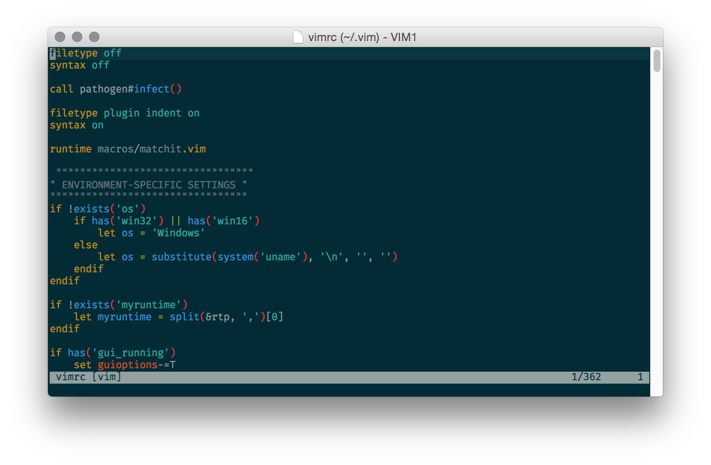
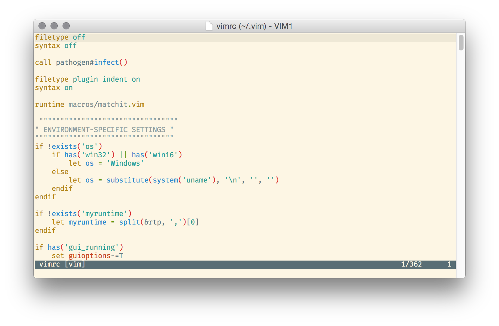
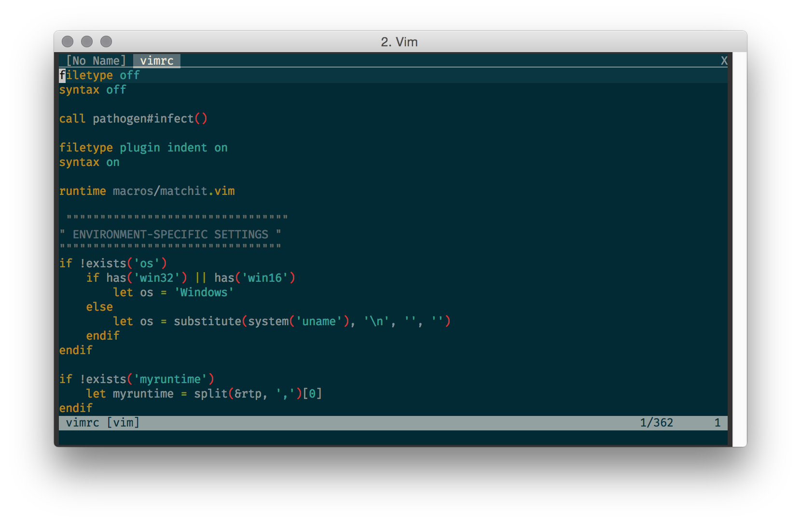
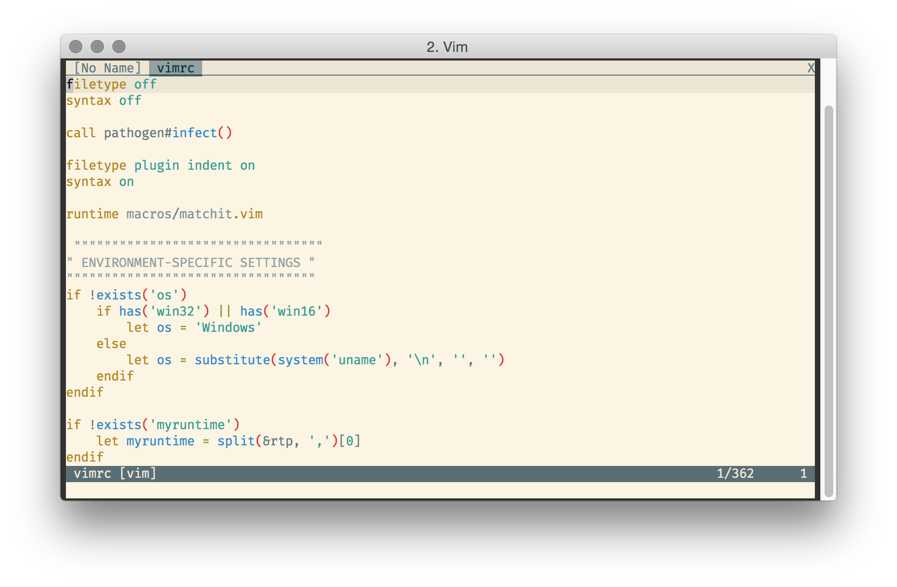

./srcery 
================================

Colorscheme inspired by [Gruvbox](https://github.com/morhetz/gruvbox) and [Railscast](https://chriskempson.github.io/base16/#railscasts). Srcery's goal is to look good using a 16 color palette. This is a fork of [Flattened](https://github.com/romainl/flattened), and tries to follow its example of simplicity.

## Requirements

### GUI

You don’t need to do anything for these colorschemes to work in GVim or MacVim.

### TUI

Flattened’s only requirement is the same as Solarized: that you change your terminal emulator’s so-called “ASCII” colors to the ones used by Solarized.

The reason is simple. Most terminal nowadays are capable of displaying 256 colors but *none* of the colors used in the Solarized palette can be found in the semi-standard Xterm palette. Therefore, we are forced to assign the Solarized non-standard values to colors 0 through 15 of our terminal emulator if we want to see the actual Solarized colors instead of poor approximations.

The exact method depends on your terminal emulator. I’d suggest simply using the values from this table and call it a day:

    TERMCOL   HEX       RGB
    -------   -------   -------------
    black     #1C1B19   28,  27,  25
    red       #FF3128   255, 49,  40
    green     #519F50   81,  159, 80
    yellow    #FBB829   251, 184, 41
    blue      #5573A3   85,  115, 163
    magenta   #E02C6D   224, 44,  109
    cyan      #1693A5   22,  147, 165
    white     #FCE8C3   252, 232, 195

    brblack   #2D2B28   45,  43,  40
    brred     #DA4939   218, 73,  57
    brgreen   #98BC37   152, 188, 55
    bryellow  #FFC66D   255, 198, 109
    brblue    #6D9CBE   109, 156, 190
    brmagenta #E35682   227, 86,  130
    brcyan    #34BEDA   52,  190, 218
    gray      #918175   145, 129, 117

## Installation

Put `flattened_dark.vim` and/or `flattened_light.vim` in `~/.vim/colors/` (on unix-like systems) or `%userprofile%\vimfiles\colors\` (on Windows).

## Configuration

What do you want to configure? It’s a freaking colorscheme!

## Usage

If you want the “dark” version:

    :color flattened_dark

If you want the “light” version:

    :color flattened_light

If you like what you see and decide to make flattened your default colorscheme, add the relevant line to your `vimrc`:

    colorscheme flattened_light

or:

    colorscheme flattened_dark

## Screenshots or it didn’t happen

### MacVim

### iTerm

