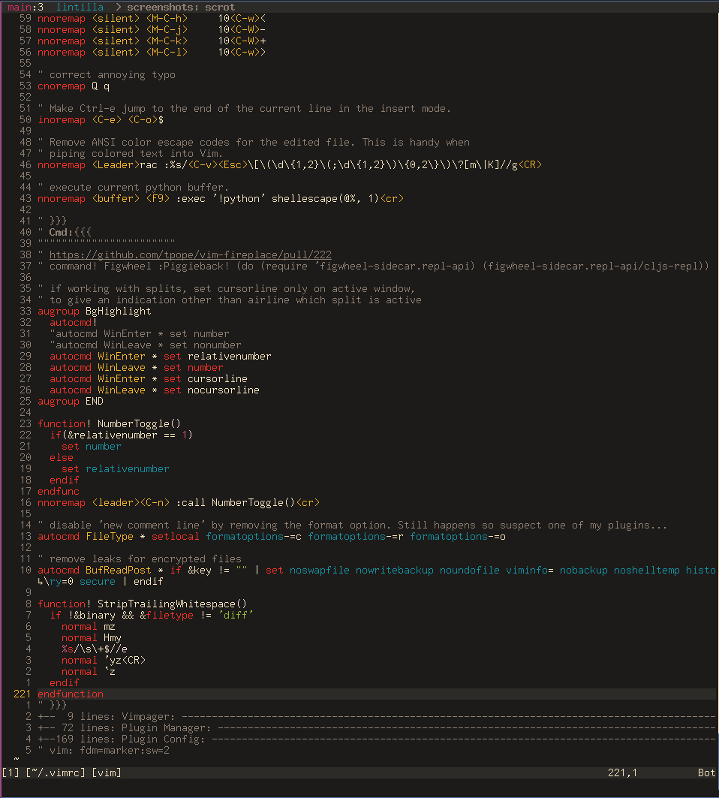
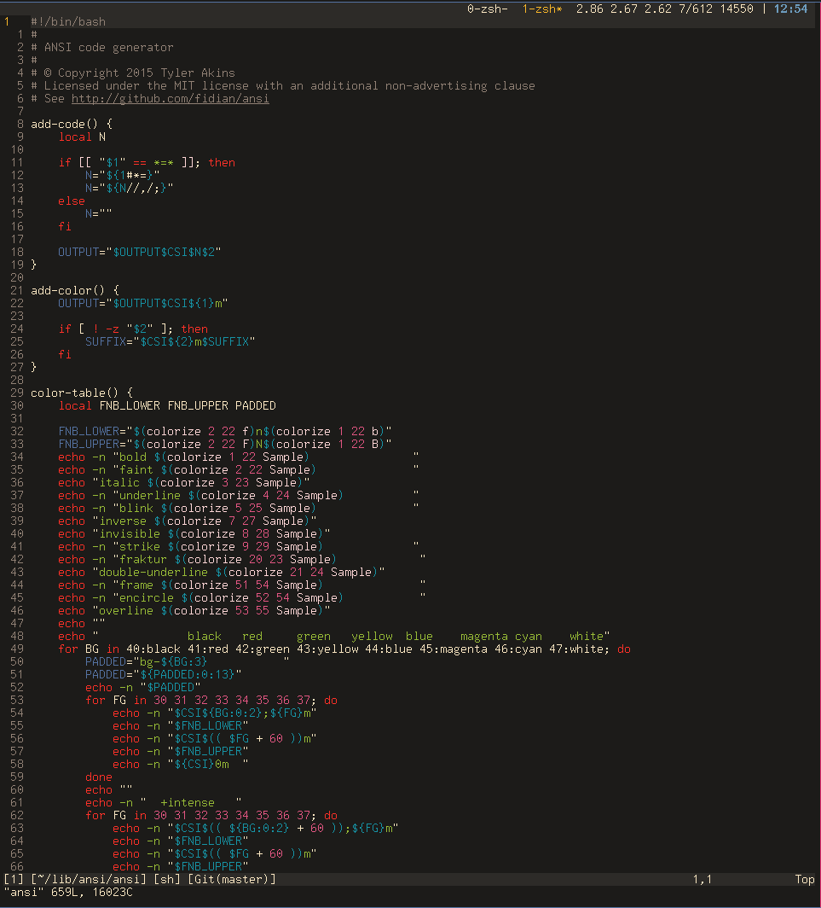
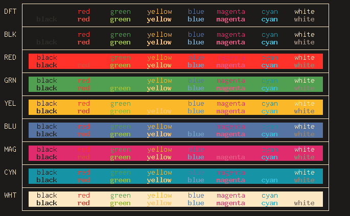

./srcery
================================

Colorscheme with ease of use and clearly defined colors that tries to somewhat stay true default xterm colors but with a twist. Heavily inspired by Gruvbox, base16, flattened and solarized ++ Please check out their respective repositories for some wonderful colorschemes.

* https://github.com/morhetz/gruvbox
* https://chriskempson.github.io/base16/#railscasts
* https://github.com/romainl/flattened
* http://ethanschoonover.com/solarized

## Requirements

### GUI

You don’t need to do anything for this colorscheme to work in GVim or MacVim.

### TUI

Srcery's only requirement is that you change your terminal emulator’s so-called “ASCII” colors to the ones in the table below.
I've included colorscheme files for various terminals in the term_color folder, but since I haven't tested all of them some issues may arrise. If your terminal is different or the file won't work please let me know so I can add/update/fix the file in question.

```
TERMCOL   HEX       RGB
-------   -------   -------------
black     #1C1B19   28,  27,  25
red       #FF3128   255, 49,  40
green     #519F50   81,  159, 80
yellow    #FBB829   251, 184, 41
blue      #5573A3   85,  115, 163
magenta   #E02C6D   224, 44,  109
cyan      #1693A5   22,  147, 165
white     #FCE8C3   252, 232, 195

brblack   #2D2B28   45,  43,  40
brred     #DA4939   218, 73,  57
brgreen   #98BC37   152, 188, 55
bryellow  #FFC66D   255, 198, 109
brblue    #6D9CBE   109, 156, 190
brmagenta #E35682   227, 86,  130
brcyan    #34BEDA   52,  190, 218
gray      #918175   145, 129, 117
```

## Installation

Put `srcery.vim` in `~/.vim/colors/` (on unix-like systems) or `%userprofile%\vimfiles\colors\` (on Windows).

Using a [plugin](https://github.com/junegunn/vim-plug) [manager](https://github.com/tpope/vim-pathogen) for vim.
```vimrc
Plug 'roosta/srcery'
```

## Configuration

I've included a few toggles due to discrepancies in the various setups possible.

#### g:srcery_bold

Enables bold text.
default: 1

#### g:srcery_italic

Enables italic text.
default: gui 1, term 0

#### g:srcery_underline

Enables underlined text.
default: 1

#### g:srcery_undercurl

Enables undercurled text.
default: 1

#### g:srcery_inverse

Enables inverse colors.
default: 1

## Usage
```
:color srcery
```

If you like what you see and decide to make srcery your default colorscheme, add the relevant line to your vimrc:
```
colorscheme srcery
```
## Screenshots.







Font used: [UW ttyp0](http://people.mpi-inf.mpg.de/~uwe/misc/uw-ttyp0/)
